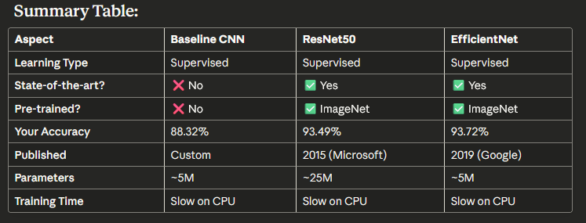

# LSUN_group_project

## 1. These part all for Supervised Learning (Ujjwal took charge of unsupervised models)

## 2. Summary table

## 3. Download LSUN raw files from http://dl.yf.io/lsun/scenes/ ,

## I choose 6 features, each feature 30,000pcs files. Each Training/Testing/Val 7000/1500/1500pcs

## 4. Run "lsun_classification.py" first. Suggest you have better CPU,GPU & RAM before running baseline CNN.

## 5. When you saw your files are not jpg files, run "convert_webp_to_jpg.py"

## 6. If you got error before confusion matrix, and you already had the model, run "create_confusion_matrix.py"
